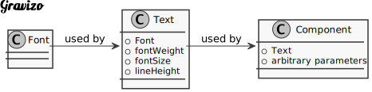
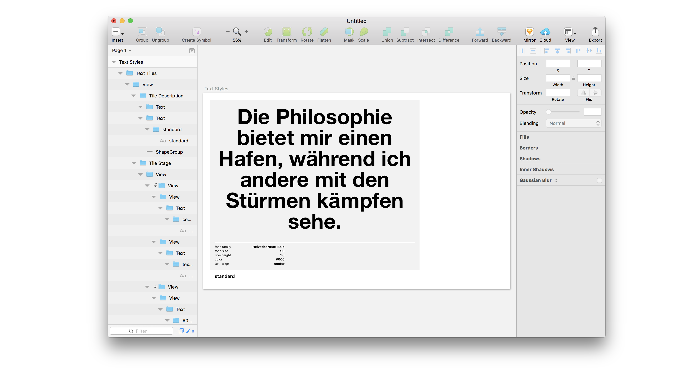

# Guide: Basic

:warning: Make sure you finished the guide [getting started guide](./guides-getting-started.md)

## 1. Create Text Styles

?> Text Styles represent bundles of text-related styling such as `font-family`, `line-height` etc. They are on a different level of abstraction than both components (`headline`, `paragraph`) and fonts.



  ```js
  // in config.js
  export default {
    texts: {
      name: 'Text Styles',
      tokens: [
        {
          name: 'huge', // Defines the name of the Text Style
          value: {
            fontFamily: 'HelveticaNeue-Bold', // Enter PostScript-Name
            fontSize: 90, // CSS styling
            lineHeight: 90, // CSS styling
            textAlign: 'center' // CSS styling
          }
        }
      ]
    }
  };
  ```

  

## 2. Make your tokens smarter

If you followed along the [Getting started]() guide you may have noticed  the Text Style CSS styling you maybe noticed that we set values we already
defined in `fonts`, `colors` and `sizes`. So lets include the references in our
styling like this:

```js
export default {
  texts: {
    name: 'Text Styles',
    tokens: [
      {
        name: 'huge', // Defines the name of the Text Style
        value: {
          fontFamily: 'HelveticaNeue-Bold', // Enter PostScript-Name
          fontSize: 90, // CSS styling
          lineHeight: 90, // CSS styling
          textAlign: 'center' // CSS styling
        }
      }
    ]
  }
};
```
