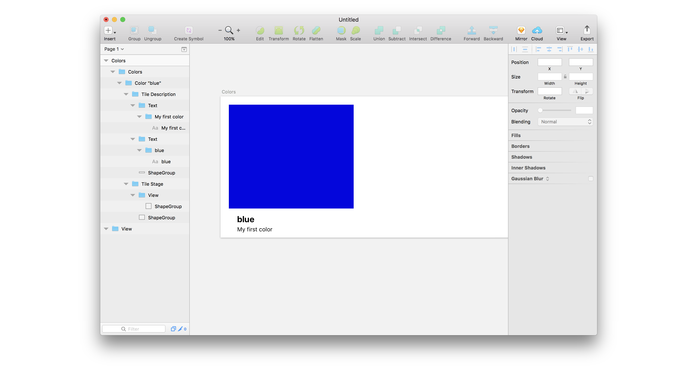
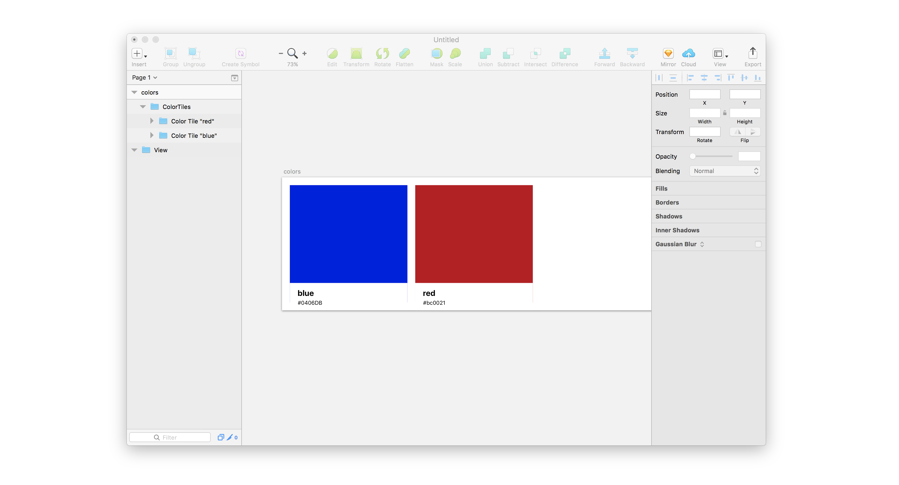
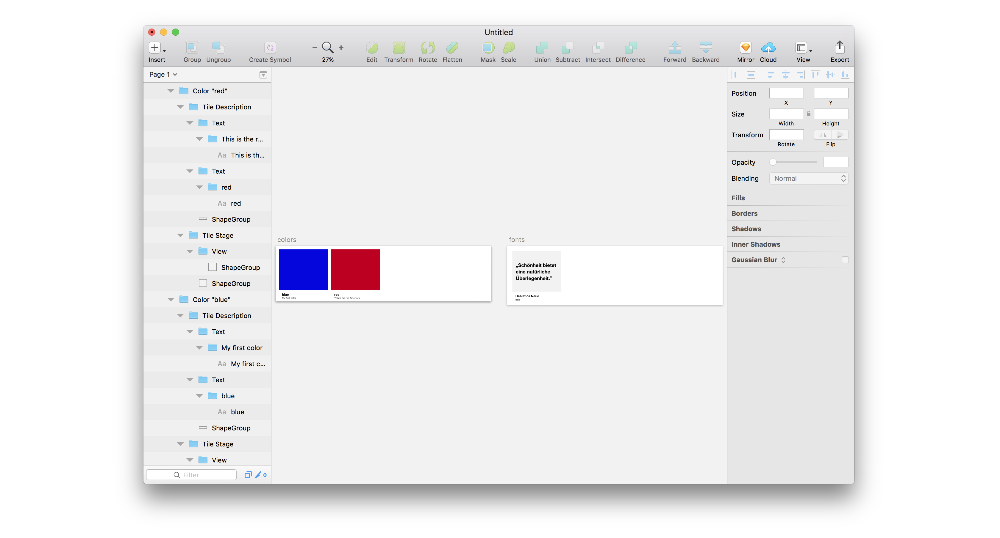
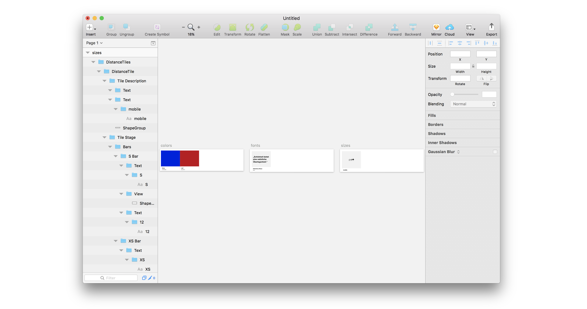

# Guide: Getting started

** :warning: Make sure you have all prerequesites installed. You can follow the [prerequesites guide](./guides-prerequesites.md) for a step-by-step instruction.**

This guide makes you familiar with `platon` and helps you to understand the basic concepts of configuring a design system.

After completion of this guide you should end up with a directory comparable to the [platon-example-getting-started](https://git.io/vQBfi) project.

[1. Setup](guides-getting-started.md#_1-Setup) <br>
[2. Create your first Artboard](guides-getting-started.md#_2-Create-your-first-Artboard) <br>
[2.1. Add more colors](guides-getting-started.md#_21-Add-more-colors) <br>
[3. Add the next Artboard with fonts](guides-getting-started.md#_3-Add-the-next-Artboard-with-fonts) <br>
[4. Define the basic sizes](guides-getting-started.md#_4-define-the-basic-sizes)

## 1. Setup

```sh
# Enter in a terminal session
curl https://codeload.github.com/sinnerschrader/platon/tar.gz/master | tar -xz --strip=2 platon-master/packages/platon-example-getting-started
cd platon-example-getting-started
atom .
npm install
npm run reset
npm start
```

If everything works a new, empty Sketch document opens and your terminal prints messages like

```
> platon-example-getting-started@1.0.3 prestart ~/platon-example-getting-started
> ensure-sketch-document

> platon-example-getting-started@1.0.3 start ~/platon-example-getting-started
> skpm build --watch --run

🖨  Copied manifest.json in 16ms
🔩  Built index.js in 3276ms
```

## 2. Create your first Artboard

* Open `config.js` in Atom
* Define your first `colors` Artboard like this:

  ```js
  // in config.js
  export default {
    colors: {
      name: 'Colors',
      tokens: [
        {
          name: 'blue',
          description: 'My first color',
          value: '#0406DB'
        }
      ]
    }
  };
  ```

* Saving `config.js` triggers the file watcher and causes a new build, producing an Artboard like this

  

## 2.1. More colors

* platon recognizes objects with the `.name`, `.description` and `.value` keys as tokens. e.g.:

  ```js
  // Next color you'll add to .colorTiles.colors
  {
    name: 'red', // Define the name of this color
    description: 'This is the red for errors', // Optionally define a description for this color
    value: '#bc0021' // Define the actual color value used for the color tile
  }
  ```

* In our example those `.tokens` live in `.colors` of `config.js`. This causes platon to inpret them as colors - you can add more color tokens by appending them to the `.colors.tokens` array.
* The following examples has two colors with the names `blue` and `red`:

  ```js
  // in config.js
  export default {
    colors: {
      name: 'colors', // Sets the name of the Artboard
      tokens: [
        {
          name: 'blue', // Define the name of this color
          description: 'My first color', // Optionally define a description for this color
          value: '#0406DB' // Define the actual color value used for the color tile
        },
        {
          name: 'red', // Define the name of this color
          description: 'This is the red for errors', // Optionally define a description for this color
          value: '#bc0021' // Define the actual color value used for the color tile
        }
      ]
    }
  };
  ```

  

* This demonstrates two important principles of `platon`
* All tokens in a platon design system have a `name`, e.g. "red" and a `value`, e.g. "#ff0000"
* All predefined Artboard types take an array of tokens. This means they can display more than one token.

## 3. Add font tokens

  ```js
  // in config.js
  export default {
    colors: {
      name: 'colors',
      tokens: [
        {
          name: 'blue',
          description: 'My first color',
          value: '#0406DB'
        },
        {
          name: 'red',
          description: 'This is the red for errors',
          value: '#bc0021'
        }
      ]
    },
    fonts: {
      name: 'fonts', // Sets the name of the artboard
      tokens: [
        {
          name: 'Helvetica Neue', // Define the name of this font
          description: 'bold', // Optionally define a description for this font
          value: 'HelveticaNeue-Bold' // Insert PostScript-Name to define the actual font used for the font tile
        }
      ]
    }
  };
  ```

* To display the right font use the `PostScript-Name` for the `family` key.

  

## 4. Define basic sizes

  ```js
  // in config.js
  export default {
    colors: {
      name: 'colors',
      tokens: [
        {
          name: 'blue',
          value: '#0406DB'
        },
        {
          name: 'red',
          value: '#bc0021'
        }
      ]
    },
    fonts: {
      name: 'fonts',
      tokens: [
        {
          name: 'Helvetica Neue',
          description: 'bold',
          value: 'HelveticaNeue-Bold'
        }
      ]
    },
    sizes: {
      name: 'sizes', // Sets the name of the artboard
      tokens: [
        {
          name: 'mobile', // Define the name of this the tile
          value: [
            {
              name: 'XXS', // Define the name of the size
              value: 3 // Define the value of the size
            },
            {
              name: 'XS', // Define the name of the size
              value: 6 // Define the value of the size
            },
            {
              name: 'S', // Define the name of the size
              value: 12 // Define the value of the size
            }
          ]
        }
      ]
    }
  };
  ```

  ?> In this token we used for the key: **value** a `number` and not a `string`. The `number` will be interpreted as a pixel value like in CSS.

**Hint:** Sketch does not automatically zoom to the new Artboard. Use `⌘ + 1` to see all Artboards on the current page.



### key value pairs
In the config.js we define everything with `key: value` pairs. The `value` is mutable and can be changed by you.
Even later in the project if you change your mind over a specific values.
The `key` is static because we referencing it in the REACT COMPONET.

<hr>

 [Continue with the Basic guide](./guides-basic#guide-basic)
